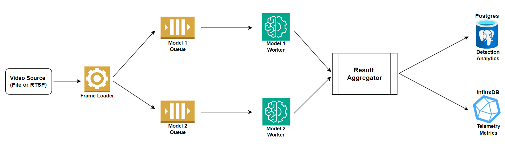

## Async and Parallel Inference Pipeline

A high-level overview of the benchmarking pipelines is available [here](../README.md).

This async pipeline variant is designed to reduce GPU idle time by separating frame loading, inference, data collation, and data I/O into independent async tasks in order to benchmark multi-model inference pipelines.

### High-Level Architecture and Workflow

1. A frame loader reads frames from the configured source and places each frame into a queue for both model workers.
2. Independent model workers run inference on the same frame stream using their own configured model, class filter, and confidence threshold.
3. An aggregator waits until both model results are available for a frame, combines the results, and updates the in-memory metrics used for reporting.
4. At the interval set in the config file, the pipeline flushes aggregated metrics to InfluxDB and PostgreSQL.
5. At the end of the run, the pipeline logs completion details, reports overall run status, and saves the active config snapshot in the `reports` folder.

### How to Use

1. General setup and infrastructure instructions are available [here](../docs/readme.md).
2. Refer to the config [instructions](../config/readme.md) for details on preparing the benchmark configuration. The async and sequential pipelines use nearly identical model and source settings, with the async pipeline adding queue and flush controls.

