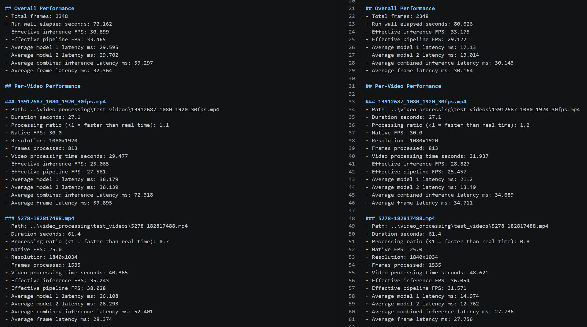

## Benchmark Reports --- W.I.P

This folder will contain reports for running various computer vision models through different pipeline topologies. As different pipeline topologies, input data and models are run on a variety of hardware, the reports will be added to this folder. 

Each pipeline produces output data in the same format and a shared report builder is used to generate the mark down reports to ensure that all reports are 1:1 comparable. In the example below a report from a pipeline that ran inferencing in parallel (on the left) is compared to a pipeline that ran the models and all data I/O sequentially (on the right).  

By using the same report builder for each pipeline, which requires the input dict to be in a specific shape, we can ensure that the reports are always 1:1 comparable across pipelines. 

Something to keep in mind: I generally build computer vision solutions for deployment at the edge, where space, power and economic constraints often restrict compute to something like an NVIDIA 4060. I.e., GPUs are available, but not ones that will heat a small room. As a result, these benchmarks will nearly always be on "lower" powered hardware as things like a NVIDIA 5090 aren't really feasible for edge deployments I tend to work on. 

