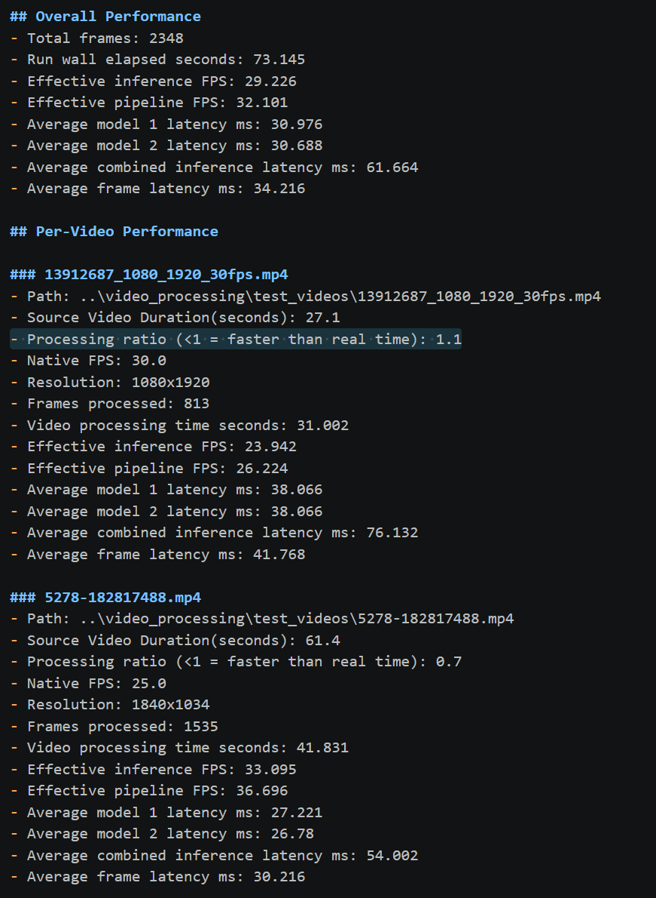

## Async Benchmark YOLOv8m on NVIDIA Mobile 4060

### Hardware Details  
* Machine: Asus NUC Performance 14 mini workstation/gaming PC running Windows 11 Pro
* GPU: NVIDIA 4060 Mobile 
* CPU: Intel Core Ultra 7 155H (3.80 GHz) w/ 96 GB of DDR5 RAM 

### Key Details
* The processing ratio in the individual video stats is the most important topline metric, namely if the ratio is <1 it means that the videos are being processed at faster than their native FPS/faster than real time. This effectively means that end users would get the data relatively quickly and there wouldn't be backlog of videos (or buffered/stored frames from an RTSP feed) that could grow over time and create downstream problems. 
* The inference FPS is calculated based on the larger of the two model latencies, as they're running in parallel. E.g., if one model runs in 30ms and the other in 25ms, the collector that collates the inference results for each frame, only has to wait 30ms. 
* The effective pipeline throughput for this topology is slightly faster than the effective inferencing FPS, this is because all of the pre and post processing in terms of API calls, frame loading, etc., is  occurring at the same time (on the CPU) as the model inferencing on the GPU, which effectively "buys" a few more milliseconds of time. 
* The benchmarks weren't run under ideal conditions, i.e., numerous background apps were running. The reason for this is that an edge inference server is often doing numerous other tasks in addition to running models: recording video feeds, sending alerts if a camera has an issue, collecting sensor data, uploading files, in addition to running several models in parallel. I.e., running tests under ideal conditions doesn't give me useful data for future edge deployments. 

### High Level Stats 

