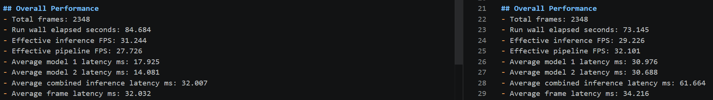

## Sequential Inference Benchmark - YOLOv8m on NVIDIA Mobile 4060

A high level overview of the sequential inference benchmark can be found [here](../sequential_inference/readme.md)

### Hardware Details  
* Machine: Asus NUC Performance 14 mini workstation/gaming PC running Windows 11 Pro
* GPU: NVIDIA 4060 Mobile 
* CPU: Intel Core Ultra 7 155H (3.80 GHz) w/ 96 GB of DDR5 RAM 

### Key Details 
* This can be viewed as the "baseline" or simplest path for building a computer vision inference pipeline, a frame is loaded, each model runs sequential, followed by data I/O and then the next frame is loaded
* The main weakness of this approach is that the GPU is idle while frames are loaded, data is uploaded, etc. 
* The other pipeline approaches, fully async and parallel, hybrid-async, etc., are all built to improve upon the performance of this pipeline. 

### Performance Notes 

* The length of both videos combined is ~88 seconds, so processing them both in nearly 85 can be considered "fast enough", however, bring it down to 73s provides more flexibility in terms of adding features, data I/O, ingesting higher resolution videos, etc.
* The async and parallel pipeline gives us a performance uplift of nearly 14% vs this one.  