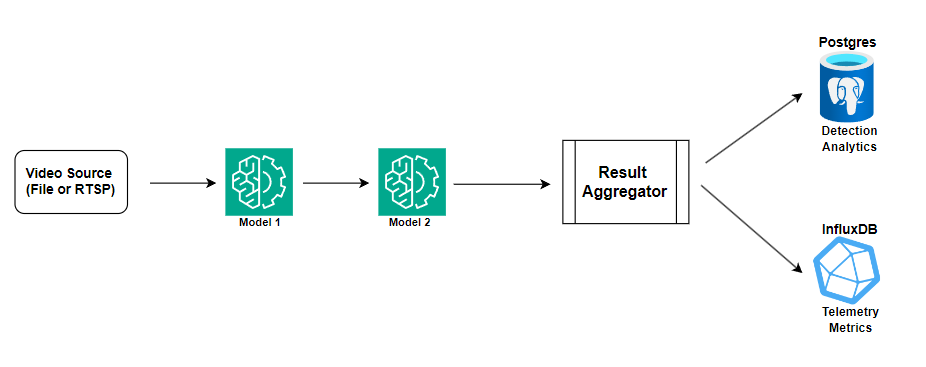

## Sequential Inferencing Pipeline

A high-level overview of the benchmarking pipelines can be found [here](../README.md).

This sequential pipeline variant is designed to benchmark two-model video inference pipelines by running both models one after the other on each frame. It can be used either as a baseline for more complex asynchronous pipelines or to benchmark workflows, such as facial recognition or privacy blurring, that require the models to run in sequence.

### High-Level Architecture and Workflow

1. A video source reads frames from the configured input source, either a local video folder or an RTSP stream.
2. The sequential orchestrator passes each frame to model 1 and then to model 2 using the configured model paths, class filters, and confidence thresholds.
3. The pipeline records the detection counts and total per-frame latency for each inference cycle.
4. At the interval set in the config file, the pipeline flushes aggregated metrics to InfluxDB and PostgreSQL.
5. At the end of the run, the pipeline logs completion details, reports overall run status, and saves the active config snapshot in the `reports` folder.

### How to Use

1. General instructions are available [here](../docs/readme.md).
2. Refer to the config [instructions](../config/readme.md) for details on setting up the config files to run a benchmark. The async and sequential pipelines use nearly identical configurations.

